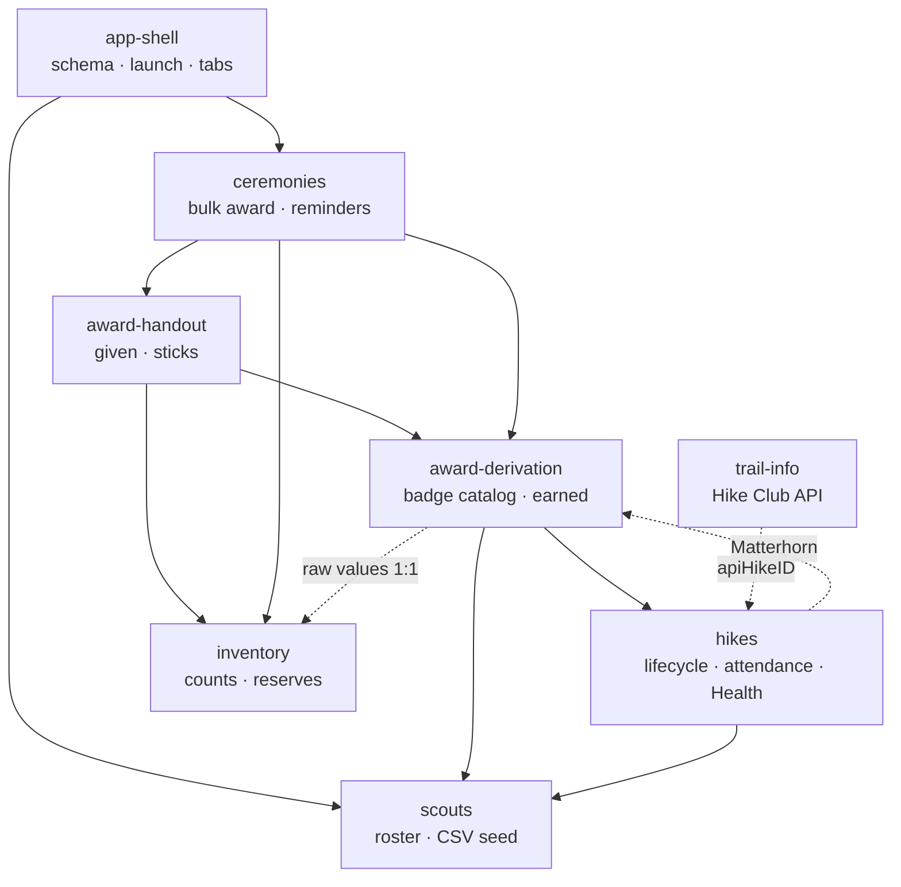
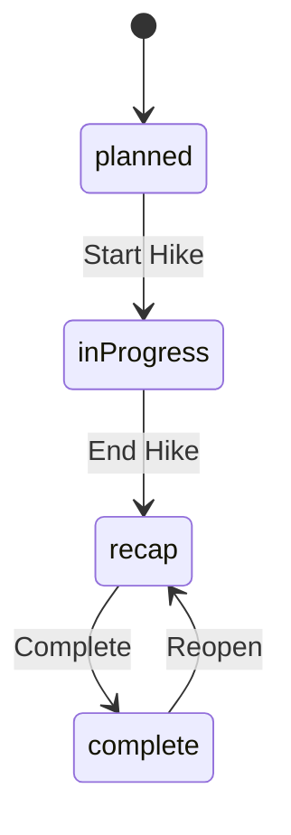

# High-Level Design: Pack 134 Hike Club

## Problem

Pack 134 runs a hike club. Scouts come on hikes, accumulate mileage, and earn badges — some for crossing mileage thresholds, some for the conditions a particular hike was held under, one for carrying their own pack. Badges and hiking sticks are physical objects that have to be ordered weeks ahead and handed out at ceremonies.

Tracked by hand, this is a cross-referencing problem that gets worse every hike. Answering "who is owed what?" means reconciling an attendance sheet against a mileage total against a list of which hikes were cold, muddy, or after dark — and then against a box in a garage to see whether the badges are even in stock. The reconciliation is error-prone in a way that shows up in public: a scout stands up at a ceremony and there is no badge for them.

## Approach

Record the hike, derive everything else.

The app captures what actually happened on a hike — who came, how far, what the conditions were — and treats every award as a *question answered from that record* rather than a fact stored alongside it. Mileage totals and earned badges are recomputed from scratch whenever they are asked for, so correcting a hike immediately corrects every downstream number with no reconciliation step that can be skipped or fail.

Running against that grain is one thing the app must remember rather than derive: which badges and sticks were physically handed over. That is an event, not a rule, so it is persisted — and the gap between "earned" and "given" is the thing ceremonies exist to close.

### Secondary disciplines

- **Status-driven editability.** A hike's lifecycle state, not a per-field rule, decides what can be edited. Adding a field means choosing which states it belongs to.
- **Inventory advises, never blocks.** Stock counts drive shopping lists and warnings. A scout who earned a badge receives it regardless of what the count says.
- **On-device by default.** All pack data stays on the phone. One optional, read-only network call is the sole exception, and nothing depends on it.

## Target Users

One person: the pack's hike club coordinator, running the app on their own iPhone. They are not a software user in any general sense — they are someone holding a phone at a trailhead in the cold with gloves on, and later sitting at a kitchen table working out what to order.

The consequences that follow: no accounts, no onboarding, no permissions model, no multi-device story. Data entry has to survive being done badly under bad conditions and corrected later.

## Goals

- A scout's cumulative mileage and earned badges are always correct given the hikes recorded, with no manual recalculation.
- The coordinator can tell, before a ceremony, exactly what to buy and how many.
- Attendance and conditions can be captured on the trail in under a minute per hike.
- A clerical error is always fixable — a completed hike can be reopened and corrected, and the corrections propagate.
- Physical inventory reflects what is actually in the box, decremented automatically as awards are handed out.

## Non-Goals

- **No multi-user.** One coordinator, one device. No accounts, no sharing, no roles.
- **No sync or backup service.** Data lives on the phone. No cloud store, no cross-device continuity.
- **No pack data leaving the device.** Scout names, attendance, and awards are never transmitted. The one network call sends a location slug and an API key and receives trail conditions.
- **No Scoutbook or external system integration.**
- **No scout- or parent-facing surface.** There is no view of this data for anyone but the coordinator.
- **No general-purpose event or scheduling system.** Hikes and ceremonies are the only two event types, and both are shaped around their specific workflow.

## Tenets

Ordered — when two conflict, the higher one wins.

- **Derive over store.** When a value could be computed from the record or persisted alongside it, compute it — even at a cost — so it cannot go stale. Persist only what has no rule to derive it from.
- **Advise, never block.** When the app knows something is off — stock is out, a badge isn't earned, a URL looks wrong — warn and proceed. The coordinator is the authority on what actually happened; the app is not.
- **Every mistake is reversible.** Prefer designs where a clerical error can be undone in the app over designs that try to prevent the error. Data entry happens in the cold with gloves on.
- **Ship the lazy version, mark the ceiling.** Prefer the simplest thing that works over the thing built for growth that may not come, and leave a `ponytail:` comment naming the shortcut's limit and its upgrade path.

Security boundaries are not subject to *advise, never block* — the https gate, the Keychain, and the path-escape rejection in `trail-info` refuse rather than warn.

## System Design

Eight segments at one level under this document. Arrows show dependency — a segment points at what it reads from.

`award-derivation` is pure: given scouts and hikes, it computes and stores nothing. Everything above it in the graph persists state. `trail-info` hangs off the side — nothing reads from it, so it can fail or be removed without affecting anything else.

### Data model

Seven SwiftData models, declared in one schema:

- `Scout` — roster identity, pre-app mileage, given badges, stick state
- `Hike` — the event, its mileage, its conditions, optional API link
- `Attendance` — the hike↔scout join, carrying per-scout qualities
- `InventoryItem` — count and minimum reserve, one per kind
- `StickAssignment` — a stick physically in a scout's hands
- `Ceremony` / `CeremonyAward` — the handout event and its snapshot

Four enums cross-reference each other and must stay in sync: `HikeQuality`, `ScoutQuality`, `BadgeType`, `InventoryKind`. Adding a badge touches all four.

### Hike lifecycle

Only `complete` hikes contribute to derived awards.

## Key Design Decisions

**Badges are derived, not stored.** Every read of a scout's earned badges recomputes from the hikes they attended. The alternative — persisting earned status and updating it when hikes change — needs an invalidation path for every mutation, and any missed path leaves a scout permanently wrong with no signal. Recomputation costs O(hikes × scouts) and is invisible at pack scale; caching is the named upgrade if it ever isn't.

**Earned and given are separate state.** `earnedBadges` is derived; `givenBadges` is persisted; nothing syncs them. This is the app's core asymmetry and it is deliberate — a scout can earn a badge in March and receive it in June, and the pack needs both facts. Collapsing them into one flag would make either "what have they earned" or "what do we owe them" underivable. The stick mirrors this exactly, with `stickEarned` as the decision and `stickAssignment` as the object.

**Ceremonies hold no list.** A ceremony stores a title, a date, and whether it happened. Who is owed what is derived every time it is opened, so a ceremony scheduled in October includes badges earned in November with nothing to re-sync. Snapshotting at scheduling time was rejected because it turns every subsequent hike correction into a reconciliation problem. The one thing snapshotted is what was actually handed out, after the fact, since that has no rule to derive it from.

**No view-model layer.** Views hold `@Query` and `@Environment(\.modelContext)` and mutate `@Model` objects in place; SwiftData autosaves. With one user on one device and no async coordination, an MVVM layer would be indirection with nothing on the other side of it. The single exception is `Awards.swift`, a `Scout` extension computing derived data — behavior that genuinely doesn't belong in a view.

**Visibility derives from hike status.** `isEditable`, `showAttendance`, and `showDetails` are computed from `hike.status` alone. Per-field editability rules were rejected as the thing that makes state machines rot: each new field invents its own rule and the states stop meaning anything.

**One network call, fenced.** Trail info is the sole exception to on-device operation. It is read-only, owner-triggered, and its response is never persisted. The API key lives in the Keychain with device-only accessibility; the base URL is https-only, enforced at the config gate rather than in UI validation; response URLs are scheme-checked before any load or link. Every one of these is load-bearing — the fence is what makes the exception acceptable.

**Local notifications over a server.** Ceremony reminders fire from `UserNotifications` on a nuke-and-repave schedule. A push service would mean a backend, an account, and pack data leaving the device — all three non-goals, for a feature that is two reminders per ceremony.

**CSV seeding, once.** The roster arrives from the pack's existing spreadsheet as a bundled CSV, imported on first launch behind an empty-table guard. `Roster.csv` is gitignored: real scout names are PII and stay out of version control.

## Success Metrics

The app is working when:

- A ceremony happens and every scout called up has their badge in the box.
- The coordinator does not maintain a parallel spreadsheet.
- Correcting a hike after the fact requires no other action.

It would be judged broken if: a scout is handed a badge the app says they didn't earn; a shopping list is wrong in a way that is only discovered at the ceremony; or trail-info being unreachable prevents any other part of the app from working.

## References

- `requirements.md` — the original product spec, including the full badge catalog and award rules
- `CLAUDE.md` — working agreements and architecture notes for this repository
- Segment designs: `docs/intent/<segment>/<segment>-design.md`
- Arrow overlay: `docs/arrows/index.yaml`
